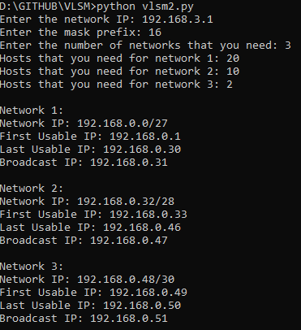

<h3 align="center">VLSM CALCULATOR</h3>

 

    Calculates subnets using a given IP and MASK, the amount of subnets and hosts for each subnet.
     
     
     
  

<!-- ABOUT THE PROJECT -->
## About The Project 🌐

A simple vlsm claculator written in Python.

1. Input the **IP-Address** you want the subnets for.
2. Input the ** prexix Mask**.
3. Input the amount of **subnets** you need.
4. Input the **hosts** you need for each subnet.

#### Screenshot

